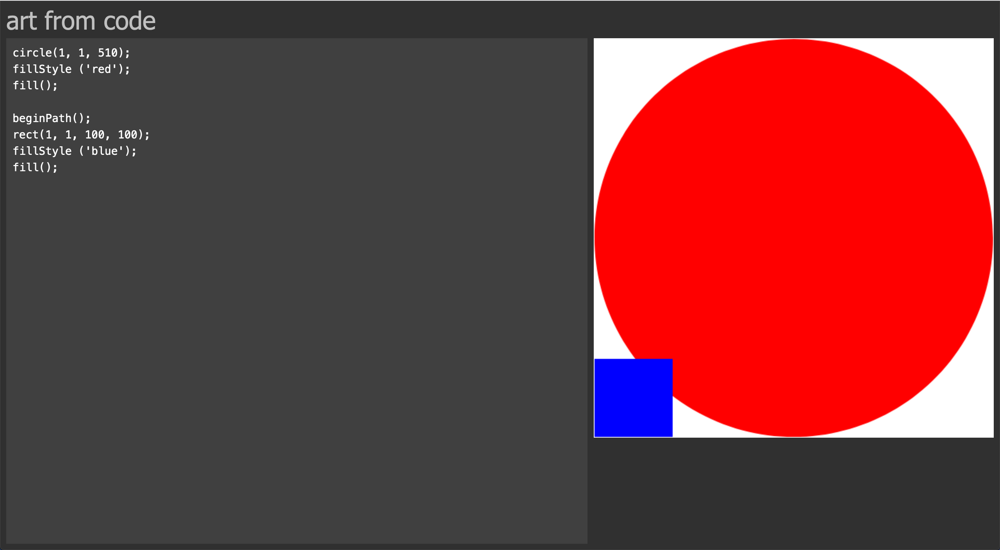

# art with code

A project for generating art assets from JavaScript code using the Canvas API 
in the browser. My use case is making simple assets for mobile games. 

    fillStyle ('red')
    rect (50, 50, 20, 20)
    fill ()

## Image dimensions
The default dimensions of the generated canvas is 512x512. Origin is at the 
bottom left corner.

## Saving your image file
To save your image, right click on the image and select "Save image as...". 
There's no better way to download your image file yet. 

## Why wouldn't I just script the Canvas API?
This tool has live preview and eliminates clutter in the image code.  

## Screenshots

